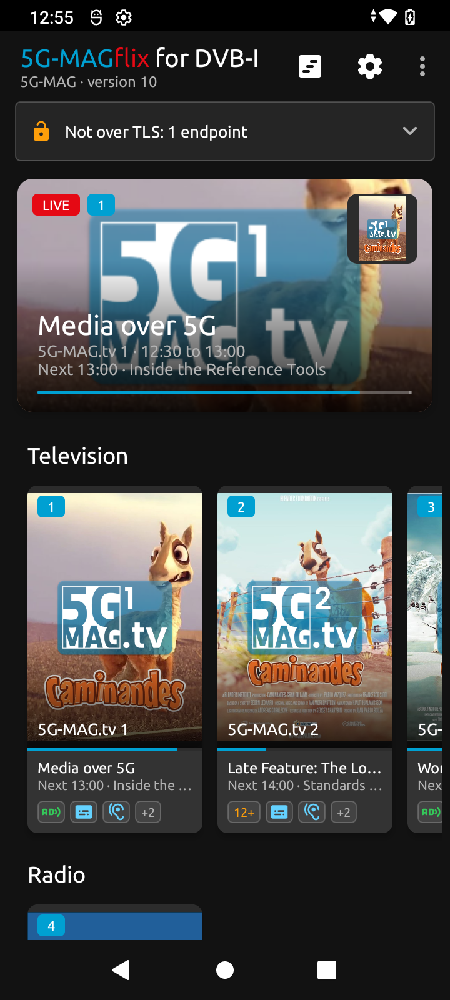
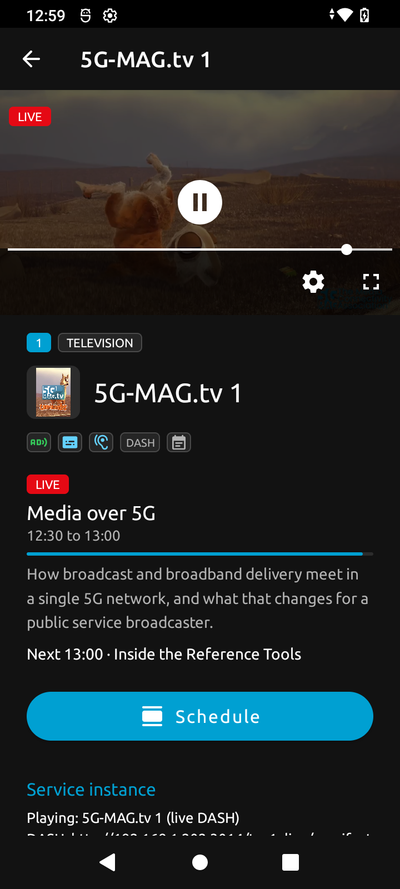
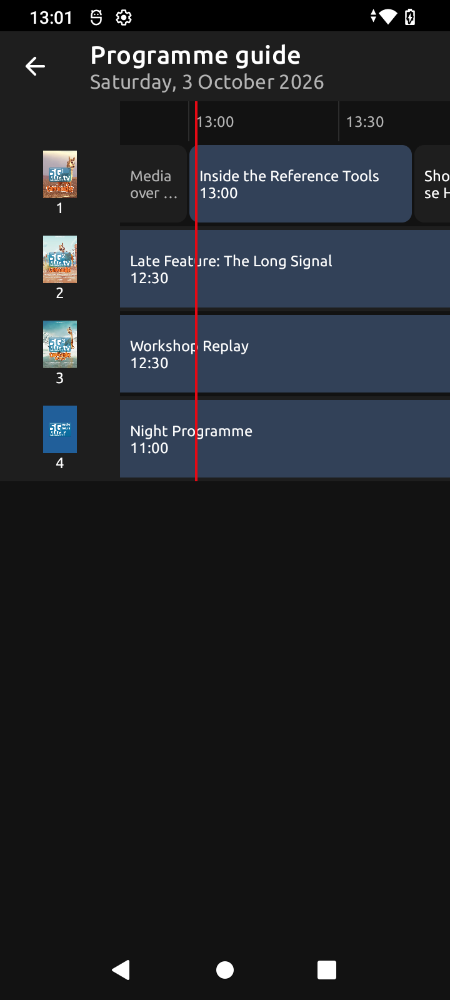

<p align="center">
  
</p>

<h1 align="center">5G-MAGflix for DVB-I</h1>

<p align="center">
  A native Android DVB-I client that discovers a service list, presents its channels with their
  content guide, and plays them with Media3 ExoPlayer, per ETSI TS 103 770, in the design of
  5G-MAGflix.
</p>

<p align="center">
  
  <a href="https://github.com/5G-MAG/rt-dvb-i-android-application/releases"></a>
  <a href="LICENSE"></a>
</p>

<p align="center">
  <a href="https://www.5g-mag.com/reference-tools/dvb-i">Project page</a> &nbsp;&middot;&nbsp;
  <a href="https://github.com/5G-MAG/rt-dvb-i-android-application/issues">Issues</a> &nbsp;&middot;&nbsp;
  <a href="https://www.5g-mag.com/contributing">Contributing</a>
</p>

---

## At a glance

|  |  |
|---|---|
| **Implements** | ETSI TS 103 770 V1.2.1 (2024-09), *Digital Video Broadcasting (DVB); Service Discovery and Programme Metadata for DVB-I*, client side |
| **Runs on** | Android 10 (API level 29) or newer |
| **Plays** | DASH, HLS and DVB-I Playlists over HTTP, via Media3 ExoPlayer 1.10.0; HTML applications and on-demand players in a WebView |
| **Part of** | [DVB-I Services over 5G Systems](https://www.5g-mag.com/reference-tools/dvb-i), alongside [rt-dvb-i-application](https://github.com/5G-MAG/rt-dvb-i-application) (the browser client), [rt-dvb-i-application-provider](https://github.com/5G-MAG/rt-dvb-i-application-provider) (the list and guide), [rt-dvb-i-service-list-registry](https://github.com/5G-MAG/rt-dvb-i-service-list-registry) (discovery), [rt-dvb-i-examples](https://github.com/5G-MAG/rt-dvb-i-examples) (runnable demos) and [rt-5gms-application](https://github.com/5G-MAG/rt-5gms-application) (the Exo DVB-I Player) |

## Introduction

This is a DVB-I client of the architecture in TS 103 770 clause 4.1, written natively for Android. It
can be pointed at a service list URL, or can ask a Service List Registry which lists exist for a
country and offer the results. It then lists the channels with now/next, shows a schedule, and plays
the selected service.

The DVB-I logic is ported from the browser client
[rt-dvb-i-application](https://github.com/5G-MAG/rt-dvb-i-application), with its clause citations.
The Gradle layout, plugin and library versions follow the 5GMSd-Aware Application
(`fivegmag_5GMSdAwareApplication`) in [rt-5gms-application](https://github.com/5G-MAG/rt-5gms-application).

This repository started as the folder `fivegmag_DVBIClient` of rt-5gms-application (pull request
[#55](https://github.com/5G-MAG/rt-5gms-application/pull/55)); its history was moved here unchanged.

### Structure

| Module | What it holds |
| --- | --- |
| `dvbi-core/` | An Android library with the DVB-I logic and no user interface: service list parsing, channel numbering (LCN), instance selection, the HTTP rules of clause 4.3, content guide requests and parsing, registry discovery, the `mbms://` URL check, and the MBMS Client interface with its `NoMbmsClient` default. No Activities, no Media3. |
| `app/` | The DVB-I client built on `dvbi-core`, "5G-MAGflix for DVB-I": home screen, player (Media3 ExoPlayer), schedule, programme guide, More Episodes and Box Sets, an application frame, settings and About, and the HTTP transport (OkHttp). Three variants, one per role: `dvbi` (plain DVB-I, the default), `dvbiMbms` (acting as MBMS-Aware Application) and `dvbi5gms` (acting as 5GMSd-Aware Application). |
| `adapter-mbms/` | The MBMS Client of [rt-mbms-mw-android](https://github.com/5G-MAG/rt-mbms-mw-android) behind the MBMS Client interface, for `dvbiMbms`. Not implemented yet. |
| `adapter-5gms/` | The 5GMSd Client through the 5G-MAG 5GMS client libraries, for `dvbi5gms`. Not implemented yet. |
| `docs/` | [`architecture.md`](docs/architecture.md): the roles, the principles, and what is open. |

The Kotlin packages are those of the single-module project (`com.fivegmag.dvbiclient.*`); the
library's Android namespace, `com.fivegmag.dvbiclient.core`, is new. It names the library's generated
build classes and changes no Kotlin package.

`dvbi-core` is what a different front end reuses. 5G additions plug in as a variant and an adapter
rather than living on branches. Until the adapters are implemented, `dvbiMbms` and `dvbi5gms` behave
as `dvbi`. See [5G Broadcast and the MBMS Client](#5g-broadcast-and-the-mbms-client) and
[5G Media Streaming](#5g-media-streaming).

### What it does

| Function | ETSI TS 103 770 V1.2.1 |
| --- | --- |
| Service list from a URL, or picked from a Service List Registry query with `TargetCountry`; a regulator list is the default whenever the response has one; the list's `@id` is checked against the registry's `ServiceListId` | clauses 5.1.3.2, 5.3; table 12; table 83 NOTE 2 |
| Services, `ServiceName` in the device language, logos (JPEG or PNG first), `TargetRegion`, `ParentalRating`, subscription packages | clauses 5.5.2, 5.2.6.2, 5.5.28; tables 15, 16 |
| Channel numbers from the one LCN table of the user's region, `LCNRange` for the rest; hidden services reachable by entering their number | clauses 5.5.12, 5.5.29; table 23 |
| Instance selection: scheduled hours, instances that cannot play discarded, then `@priority`; the next instance on a playback error; re-evaluation when an instance enters or leaves its hours | clauses 5.2.5.2, 5.2.13 |
| DASH (`DASHDeliveryParameters`) and HLS (annex G.2.2 and G.2.3) played with Media3 ExoPlayer | clause 5.5.4; annex G |
| 5G Broadcast instances (`IdentifierBasedDeliveryParameters` with an `mbms://` locator) shown with a badge, the locator checked against 3GPP TS 26.347 V18.1.0 clause 8.2.2, and not played: there is no MBMS Client on Android yet | clause 9.3.3 |
| HTTP: `max-age` (less the response's age from `Age` and `Date`), else `Expires`; `no-store` not stored, `no-cache` always revalidated; `If-Modified-Since`, `If-None-Match`, no retry after 400 or 406, `Retry-After`, the back-off, the next `ServiceListURI` on failure | clause 4.3; ETSI TS 102 796 V1.8.1 clause 7.3.2.6; IETF RFC 7230, RFC 7234 |
| Plain HTTP shown with a warning quoting the clause 7.3 exception and saying whether the endpoint is on the phone's private subnet | clause 7.3 |
| TLS 1.3 and 1.2 only, with the cipher suites of table 15a (mandatory ones included, forbidden ones excluded); a certificate chain with an RSA key under 2 048 bits, a root under 112 bits of security or an MD5 or SHA-1 certificate signature fails the connection | clause 7.3; ETSI TS 102 796 V1.8.1 clause 11.2 |
| Now/next in the channel list and the player, a schedule view, a programme guide grid, programme information with its series position, secondary title and keywords; a 404 from the content guide re-acquires the service list, then backs off | clauses 4.3.3.4, 6.1, 6.5, 6.6; table 41 |
| Parental restriction by age, the programme's rating taking precedence over the service's | clause 5.5.28 |
| Access services of each instance's media shown as badges: subtitles (carriage, purpose, language; unknown terms taken as unavailable), audio description, sign language, dialogue enhancement, spoken subtitles | clause 4.5.2 |
| More Episodes and Box Sets (categories, lists, contents), one page at a time with the pagination links; on-demand programmes offered when available and playable by their Template XML AIT, and started from their content deep-linked XML AIT | clauses 5.2.4, 6.7, 6.8, 6.9; table 52 |
| Linked applications: an application controlling media presentation replaces the media; an application with media in parallel, the home page, or the application for outside the availability period opened on request; XML AIT application selection, the platform profile included, with the contextual parameters | clauses 5.2.3, 5.2.4.2, 5.2.4.4.6; ETSI TS 102 796 V1.8.1 table 5 |
| DVB-I Playlists from a playlist server, their entries played in order, then the content finished image | clauses 5.2.7.2, 5.2.7.3, 5.7.1 |

### Not implemented

HbbTV applications (the application engine starts HTML pages), application signalling inside the media (clause 5.2.3.3), Restart
links (clause 5.2.4.3), credits (their display names are table 69), the daily service list update (clause
5.1.7), a PIN to unlock restricted content, and re-authentication after 401 or 403.

## Screenshots

On a phone, with the DVB-I live demo of rt-dvb-i-examples:

<p align="center">
  
  
  
</p>

## User interface

The user interface is based on the design of 5G-MAGflix, the 5GMSd Aware Application in
[5G-MAG/rt-5gms-application](https://github.com/5G-MAG/rt-5gms-application), by Daniel Silhavy (Fraunhofer
FOKUS): its dark theme and colours, the layouts of its home screen, cards, detail page, settings and About,
and its adapters. The files derived from it carry its author and copyright beside this adaptation's.

- **Font:** Ubuntu (Ubuntu Font Licence 1.0), downloaded at run time from the Google Fonts provider of
  Google Play services (`app/src/main/res/font/`); no font file is bundled. Without the provider, Android's
  default font is used.
- **Icons:** [Material Symbols](https://github.com/google/material-design-icons) (Google, Apache License 2.0),
  as vector drawables named `ic_*.xml`; the Reference Tools icon is the one of the 5G-MAG website.
- **From the 5G-MAG website:** the launcher icon and splash screen are the DVB-I Services over 5G Systems
  project icon (`device-tv`, a Tabler icon, MIT licence); the top bar shows the
  white 5G-MAG logo (`logo_5g_mag_white.png`, from the website's `static/img/5g-mag-logo-white.png`).
- **From 5G-MAGflix:** the GitHub mark and the LinkedIn and Slack icons of the About screen, and the
  "5G-MAG" and "flix" lettering of the title.

What every badge means is listed under *Icons* on the About screen.

## Credits

The user interface is based on the design of 5G-MAGflix, the 5GMSd Aware Application in
5G-MAG/rt-5gms-application, by Daniel Silhavy (Fraunhofer FOKUS):
<https://github.com/5G-MAG/rt-5gms-application>.

## Specification

Built against **ETSI TS 103 770 V1.2.1 (2024-09)**, a version rather than a release name. Where the
client follows ETSI TS 102 796 (cache rules) it is V1.8.1; the MBMS URL check and the MBMS Client
interface follow 3GPP TS 26.347 V18.1.0.

Clause-by-clause coverage, and what is still absent, is recorded on the project page rather than
here: <https://www.5g-mag.com/reference-tools/dvb-i>

For 5G Broadcast it checks and shows the `mbms://` signalling rather than playing it; see
[5G Broadcast and the MBMS Client](#5g-broadcast-and-the-mbms-client) below.

## Install dependencies

The build needs a JDK 17 or 21 (the Android Gradle Plugin 9.2.0 does not run on newer ones) and the Android
SDK with platform `android-37.0` and build-tools `37.0.0`. Everything else (Gradle 9.5.0, the plugins and the
libraries) is downloaded by the Gradle wrapper from Google's Maven repository and Maven Central. No 5G-MAG
library has to be published to Maven Local first.

These commands install the toolchain without root rights and without changing any shell profile. They are
the ones used to build this application on Linux x86_64.

```sh
# JDK 21 (Eclipse Temurin 21.0.12.1+1) under ~/opt
mkdir -p ~/opt && cd ~/opt
curl -LO https://github.com/adoptium/temurin21-binaries/releases/download/jdk-21.0.12.1%2B1/OpenJDK21U-jdk_x64_linux_hotspot_21.0.12.1_1.tar.gz
echo "ce79869e1307ed8ee1e2baa86a412b1eb5b75d10a01006d788a6f968bcfaee94  OpenJDK21U-jdk_x64_linux_hotspot_21.0.12.1_1.tar.gz" | sha256sum -c
tar -xzf OpenJDK21U-jdk_x64_linux_hotspot_21.0.12.1_1.tar.gz

# Android command-line tools (build 15859902) under ~/Android/Sdk
mkdir -p ~/Android/Sdk/cmdline-tools && cd ~/Android/Sdk/cmdline-tools
curl -LO https://dl.google.com/android/repository/commandlinetools-linux-15859902_latest.zip
echo "4e4c464f145a7512b57d088ac6c278c03c9eea610886b35a5e0804e74eedf583  commandlinetools-linux-15859902_latest.zip" | sha256sum -c
unzip -q commandlinetools-linux-15859902_latest.zip && mv cmdline-tools latest

# Environment for this shell only
export JAVA_HOME=$HOME/opt/jdk-21.0.12.1+1
export ANDROID_HOME=$HOME/Android/Sdk
export PATH=$JAVA_HOME/bin:$ANDROID_HOME/platform-tools:$PATH

# SDK licences (read them), then the packages the build uses
$ANDROID_HOME/cmdline-tools/latest/bin/sdkmanager --licenses
$ANDROID_HOME/cmdline-tools/latest/bin/sdkmanager --install "platforms;android-37.0" "build-tools;37.0.0" "platform-tools"
```

The checksums are the ones published on adoptium.net and developer.android.com/studio for these files.

## Downloading

```bash
cd ~
git clone https://github.com/5G-MAG/rt-dvb-i-android-application.git
```

## Building

With `JAVA_HOME` and `ANDROID_HOME` set as above:

```sh
cd rt-dvb-i-android-application/
./gradlew test             # JVM unit tests
./gradlew assembleDvbiDebug    # app/build/outputs/apk/dvbi/debug/app-dvbi-debug.apk
```

Each variant has its own task and APK; `./gradlew assembleDebug` builds all three:

| Variant | Task | APK | Application ID |
| --- | --- | --- | --- |
| `dvbi` | `assembleDvbiDebug` | `app/build/outputs/apk/dvbi/debug/app-dvbi-debug.apk` | `com.fivegmag.dvbiclient` |
| `dvbiMbms` | `assembleDvbiMbmsDebug` | `app/build/outputs/apk/dvbiMbms/debug/app-dvbiMbms-debug.apk` | `com.fivegmag.dvbiclient.mbms` |
| `dvbi5gms` | `assembleDvbi5gmsDebug` | `app/build/outputs/apk/dvbi5gms/debug/app-dvbi5gms-debug.apk` | `com.fivegmag.dvbiclient.fivegms` |

The application IDs differ, so the variants can be installed side by side.

## Installing

Over adb, with the phone connected by USB and USB debugging enabled:

```sh
adb devices
adb install -r app/build/outputs/apk/dvbi/debug/app-dvbi-debug.apk
```

Without adb, copy `app-dvbi-debug.apk` to the phone (for example by download or file transfer) and open it there,
allowing the installation of applications from that source when Android asks.

## Running

### The demo over Wi-Fi

The phone and the laptop are on the same Wi-Fi network (for the demo, 192.168.1.0/24, with the laptop at
192.168.1.202). On the laptop, start the DVB-I live demo of
[rt-dvb-i-examples](https://github.com/5G-MAG/rt-dvb-i-examples) (`scripts/dvbi-live-demo`) so that it serves
on its Wi-Fi address rather than on `localhost`:

```sh
cd rt-dvb-i-examples/scripts/dvbi-live-demo
DEMO_HOST=192.168.1.202 ./start-all.sh
# ...
DEMO_HOST=192.168.1.202 ./stop-all.sh
```

The demo's own README describes its options. The service list, logos, content guide and media URLs all come
from the service list, so nothing else is configured in the app.

On the phone, the defaults point at the laptop:

| Setting | Default |
| --- | --- |
| Service list URL | `http://192.168.1.202:4000/service-list.xml` |
| Service List Registry endpoint | `http://192.168.1.202:7000/query` |

TS 103 770 V1.2.1 clause 5.1.3.2 defines the registry endpoint as the scheme, authority and path, so the path
`/query` is part of the setting. Other defaults can be built in with
`-PdvbiServiceListUrl=... -PdvbiRegistryUrl=...`, together with `-PdvbiCleartextHosts=...` for their host.

In **Settings**, *Query the registry and pick a list* sends the query (with `TargetCountry` when a country is
set) and offers the lists with the default marked; *Save* installs the chosen one. While the endpoints are
reached without TLS, the home screen shows a one-line plain HTTP notice under the toolbar, which a tap opens
to the full clause 7.3 warning.

## Configuration

### Plain HTTP and the network security configuration

ETSI TS 103 770 V1.2.1 clause 7.3 requires HTTP over TLS towards service list registries, service list servers
and content guide servers, with one exception: "For the specific case that a DVB-I client connects to a DVB-I
metadata endpoint located on the same private subnet (see clause 3 of IETF RFC 1918 [27]), HTTP may be used
without TLS."

Android blocks plain HTTP unless the application's network security configuration allows it. This
application does not allow it in general: the build writes a configuration that permits cleartext only to the
hosts named in the Gradle property `dvbiCleartextHosts` (comma separated), and to no other host. The default
is `192.168.1.202`, the demo laptop's Wi-Fi address. For another address:

```sh
./gradlew assembleDebug -PdvbiCleartextHosts=192.168.0.10
```

The list is fixed when the APK is built, because Android reads the network security configuration from the
APK. HTTPS works towards any host.

## 5G Broadcast and the MBMS Client

`dvbi-core/src/main/java/com/fivegmag/dvbiclient/mbms/IMbmsStreamingClient.kt` is the part of the TS 26.347 Media Streaming Service API (clause 6.3, method
names of the annex B.3 IDL) this client calls: `registerStreamingApp`, `getStreamingServices`,
`startStreamingService`, `stopStreamingService`, `deregisterStreamingApp`, and the callbacks
`registerStreamingResponse`, `serviceStarted`, `streamingServiceError` and `streamingServiceListUpdate`. The
client registers with the service class of TS 103 770 table 106, `urn:dvb:metadata:serviceClass:DVB-I_Service_Instance:1`.
`NoMbmsClient` refuses the registration, so 5G Broadcast instances are discarded and another instance plays.
An Android MBMS Client implements the interface and is supplied by the variant's `Role`
(`app/src/<variant>/`) to `MbmsSession` (`DvbiSession.mbms`), which registers once when the first activity
opens, reads the service list after the registration response and after each `streamingServiceListUpdate`,
stops the started service when another instance plays or the player is left, and deregisters when the last
activity closes. The player starts the User Service whose `serviceId` is the locator's prefix and plays its
`ManifestURI`. In the `dvbiMbms` variant that client is `adapter-mbms`, which answers as
`NoMbmsClient` for now: the MBMS Middleware's MwService does not yet offer an interface to bind to (see
[adapter-mbms/README.md](adapter-mbms/README.md)).

`DvbiSession` and the activities are in `app`; the interface, `NoMbmsClient`, `MbmsSession`, the locator
check and the choice of entry point (`MbmsReception`) are in `dvbi-core`, so an MBMS Client is supplied without
changing either module's DVB-I logic.

## 5G Media Streaming

The `dvbi5gms` variant is where the DVB-I client acts as 5GMSd-Aware Application, through
`adapter-5gms`. Nothing for 5G Media Streaming (5GMS) is implemented yet (see
[adapter-5gms/README.md](adapter-5gms/README.md)). Another 5GMS front end can also depend on `dvbi-core`
for the DVB-I logic and bring its own 5GMS client, for example
[rt-5gms-application](https://github.com/5G-MAG/rt-5gms-application).

5GMS Service Access Information has no element in a DVB-I service list or playlist. ETSI TR 103 972
(V1.1.1, 2023-07) records both as gaps in existing specifications:

- ETSI TR 103 972 V1.1.1 clause 6.3.4, gap 1: "DVB-I service instance metadata needs to be extended
  to include baseline 5GMS Service Access Information parameters."
- ETSI TR 103 972 V1.1.1 clause 6.3.4, gap 2: "the DVB-I Playlist entry element needs to be extended
  to include baseline 5GMS Service Access Information parameters."

ETSI TS 103 770 V1.2.1 defines no such element, so this client invents none.

## Development

This project follows the [Gitflow workflow](https://www.atlassian.com/git/tutorials/comparing-workflows/gitflow-workflow).
The `development` branch of this project serves as an integration branch for new features.

`./gradlew test` runs the JVM unit tests, which need no device: 121 cases in `dvbi-core`, and in `app` one
case (the TLS profile of the HTTP transport), run once per variant. The activities have no automated tests. CI runs `./gradlew test assembleDebug` from
`.github/workflows/test.yml`.

## Contributing

Contributions are welcome. How to raise an issue, fork the repository and open a pull request, and
the Contributor License Agreement required before code can be merged, are described at
<https://www.5g-mag.com/contributing>.

## License

Distributed under the 5G-MAG Public License v1.0. See [LICENSE](LICENSE).
